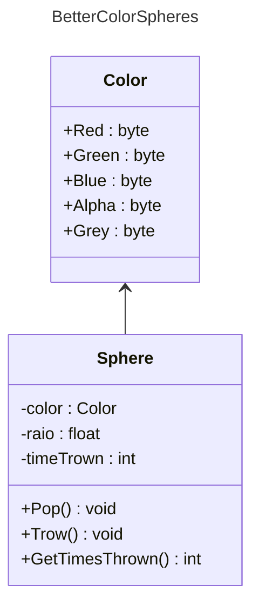

```mermaid
---
title : BetterColorSpheres
---
classDiagram

Color <-- Sphere
class Color{
    +Red : byte 
    +Green : byte 
    +Blue :  byte 
    +Alpha : byte 
    +Grey : byte 

}
class Sphere{
    -color : Color
    -raio : float
    -timeTrown : int 
    +Pop() void
    +Trow() void
    +GetTimesThrown() int

}
```